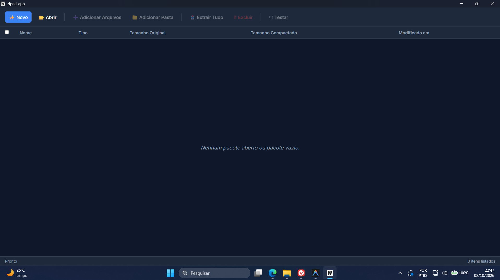
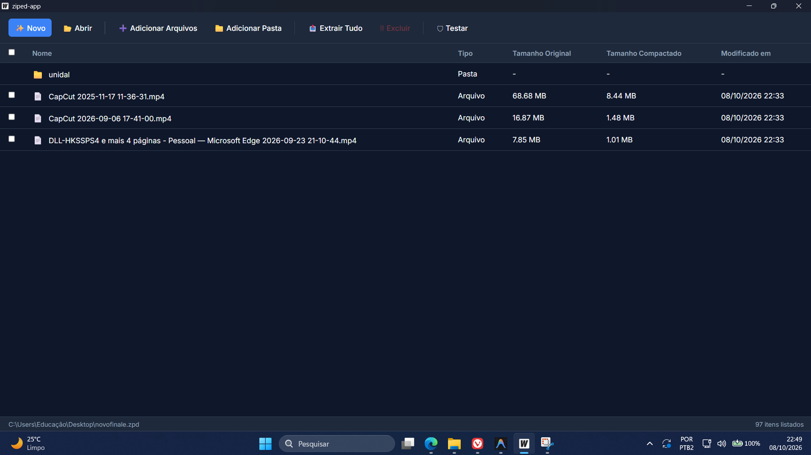
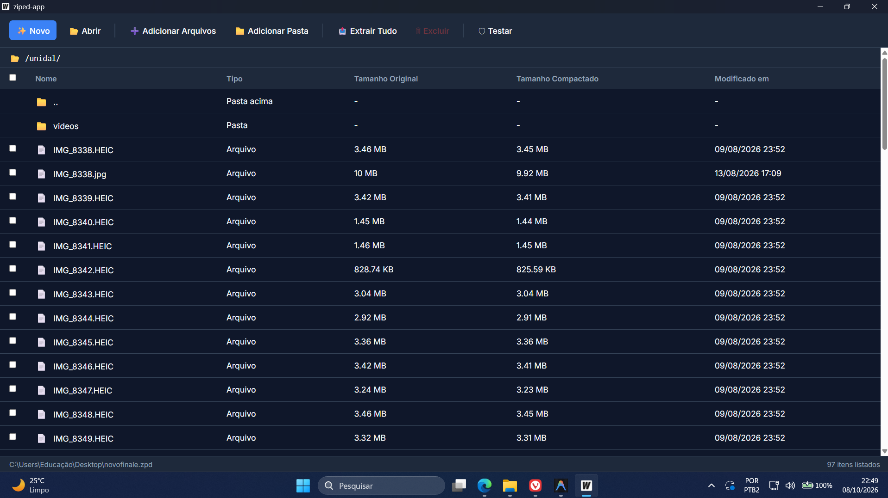

# Ziped - Gerenciador de Arquivos Compactados

### Tela Principal


### Navegando em um Arquivo ZIP




**Ziped** é um aplicativo desktop robusto e elegante, inspirado em ferramentas como WinRAR e 7-Zip, focado no gerenciamento, criação e extração de arquivos compactados. Desenvolvido para o Desafio de Desenvolvimento, ele utiliza o poder do **Go** (para máxima performance no processamento de arquivos) e do **Svelte** (para uma interface moderna e fluida).

## 🚀 Funcionalidades

- **Formato Próprio (`.zpd`)**: Crie, visualize, altere e extraia arquivos utilizando um formato de compactação exclusivo.
- **Suporte Total a ZIP**: Crie novos pacotes, extraia, liste conteúdos e modifique arquivos ZIP existentes.
- **Suporte a RAR e 7z**: Funcionalidade de leitura e extração para os formatos RAR e 7z.
- **Interface Intuitiva**: Navegação interna por pastas dentro dos pacotes compactados.
- **Drag and Drop**: Arraste arquivos diretamente para a interface para adicioná-los a um pacote.
- **Feedback Visual**: Acompanhe o progresso de operações demoradas (como compactação e extração).
- **Segurança e Estabilidade**: Tratamento avançado de erros (arquivos corrompidos, falta de espaço, etc.) e teste de integridade.

## 🛠️ Tecnologias Utilizadas

- **[Wails](https://wails.io/)**: Framework para construção de aplicativos desktop usando tecnologias web.
- **[Go](https://go.dev/)**: Backend de alta performance para lidar com o sistema de arquivos e algoritmos de compressão pesados.
- **[Svelte](https://svelte.dev/)**: Frontend reativo, rápido e leve.
- **[TypeScript](https://www.typescriptlang.org/)**: Tipagem estática para maior segurança no frontend.

## 💻 Como Executar (Desenvolvimento)

Para rodar o projeto em modo de desenvolvimento com *Hot Reload*:

1. Certifique-se de ter o [Go](https://go.dev/doc/install) e o [Node.js](https://nodejs.org/) instalados.
2. Instale a CLI do Wails: `go install github.com/wailsapp/wails/v2/cmd/wails@latest`
3. Na raiz do projeto, execute:

```bash
wails dev
```

Isso iniciará um servidor de desenvolvimento. Alterações no frontend (Svelte) ou backend (Go) serão refletidas automaticamente.

## 📦 Como Compilar (Produção / Build)

Para gerar o executável final otimizado, que não exige nenhuma dependência (Go ou Node) para o usuário final:

```bash
wails build
```

O arquivo compilado (`.exe` no Windows) estará disponível dentro da pasta `build/bin/`.

## 📂 Estrutura do Projeto

O projeto segue uma separação clara de responsabilidades:
- `/backend`: Lógica em Go. Processamento de arquivos, leitura/escrita de formatos, compressão, *streams* e comunicação com o sistema operacional.
- `/frontend`: Interface do usuário em Svelte/TypeScript. Responsável unicamente pela camada visual, stores de estado e chamadas para os serviços do backend via Wails.
